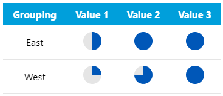

# Overview
Use this custom visual to create a table of [Harvey Ball](https://en.wikipedia.org/wiki/Harvey_balls) elements based on the metric values provided.

The implementation of the Harvey Ball visual elements utilizes SVG code that allows for scaling without pixelation or loss of resolution.